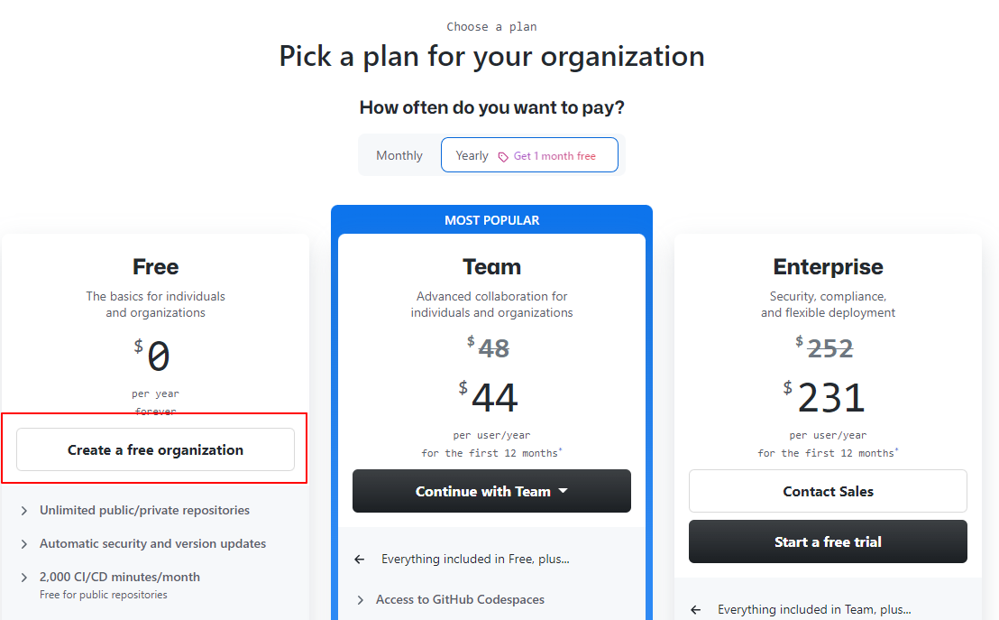
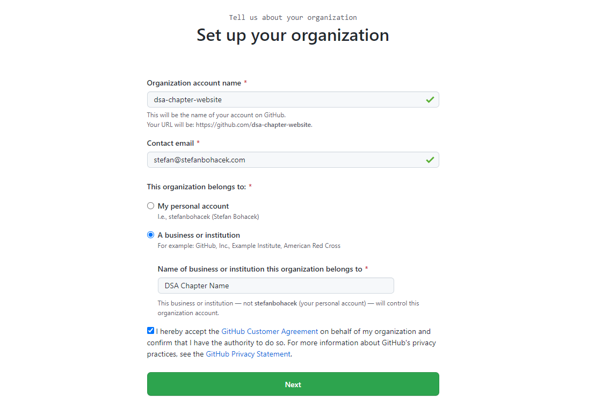
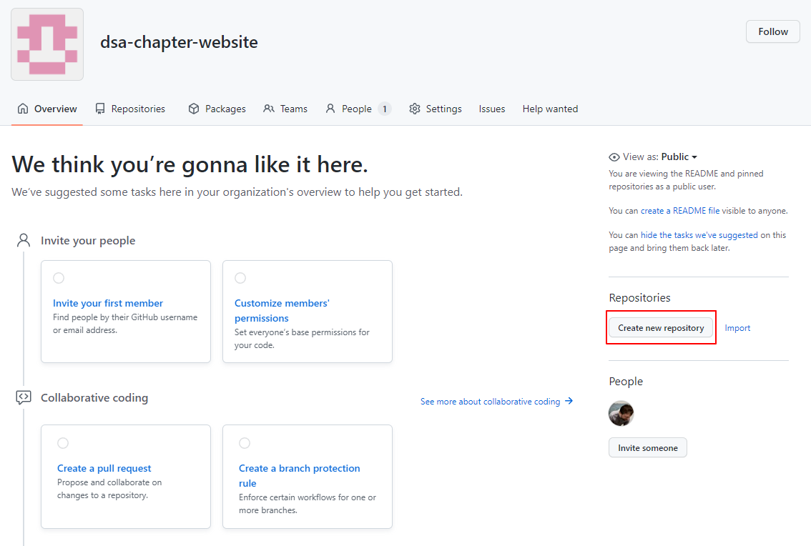
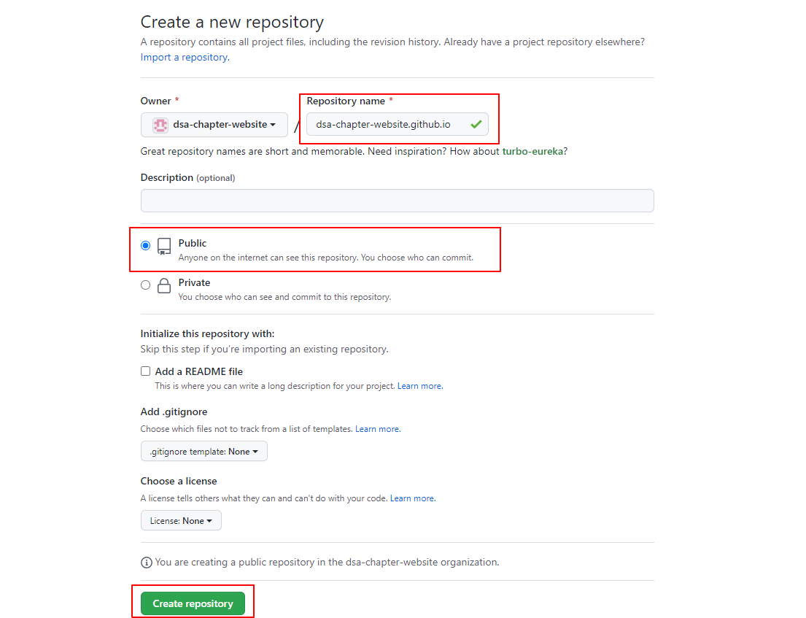
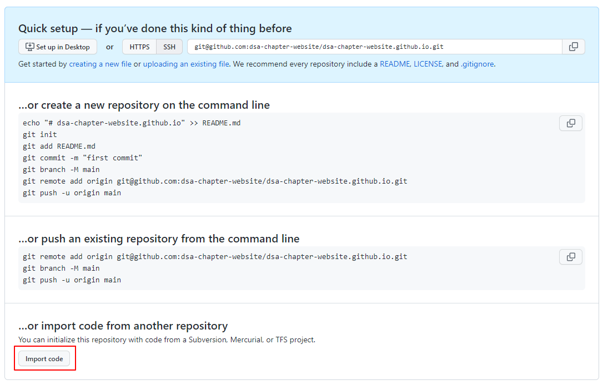
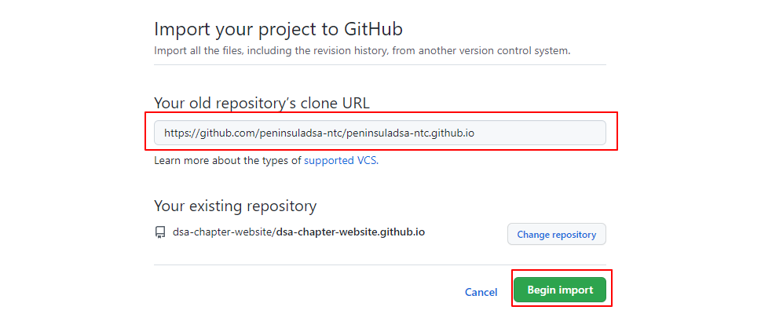
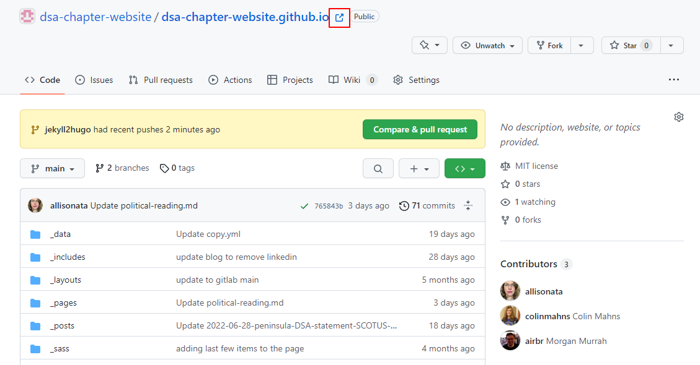

# DSA Chapter In a Box Website Runbook

Smaller Chapters and Organizing Committees of the [Democratic Socialists of America](https://www.dsausa.org/) (refered herein as "Chapters" for shorthand), or Chapters without a dedicated internal Tech committee, may lack a web presence outside of Corporate owned Social Media. To assist with this, the [National Tech Committee (NTC)](https://tech.dsausa.org/) has created this runbook to help quickly get Chapter webpages up and running with DSA branding.

An example webpage can be viewed at [peninsula.dsachapters.org](https://peninsula.dsachapters.org/) ([source code](https://github.com/peninsuladsa-ntc/peninsuladsa-ntc.github.io)). The tools used to create it consist of:

- [Jekyll](https://jekyllrb.com/), a static site generator
    - For documentation please visit [jekyllrb.com/docs](https://jekyllrb.com/docs).
- A theme based on the [Lone Wolf](https://github.com/manid2/lone-wolf-theme) Jekyll theme for a consistent visual style
    - See [an example page here](https://manid2.github.io/lone-wolf-theme/).
- The [Markdown formatting language](https://daringfireball.net/projects/markdown/basics) for adding and updating content
- [GitHub Pages](https://docs.github.com/en/pages) for hosting the site
    - You can learn more about GitHub Pages at [pages.github.com](https://pages.github.com/) and you will find a detailed walkthrough in [GitHub Docs](https://docs.github.com/en/pages).

You can also opt-in to self-host your site if your Chapter has a webserver, this is however out of scope of this document.

## Expectations and Limitations

This project's function is for the NTC to provide the means for smaller DSA Chapters to establish a Jekyll based website quickly and at no cost. The ownership (e.g. updates to content, updates to theme, customization) is expected to fall on the individual Chapter with minimal support from the NTC outside of onboarding. There is no requirement the website must be hosted on GitHub Pages, use this Jekyll theme, or use this project.

Jekyll, the base code for this website and this project, is a static website generator, meaning some "dynamic" functionality like a comments section, dynamic chapter calendars for tracking events, or some embedded media, are not supported. The [Jekyll documentation](https://jekyllrb.com/docs) can help further explain what will and won't work if implemented on your website. See [this helpful comparison between static and dynamic webpages](https://about.gitlab.com/blog/2016/06/03/ssg-overview-gitlab-pages-part-1-dynamic-x-static/) that further explains the difference.

## Installation

You will need a GitHub account and a GitHub organization for your Chapter. While GitHub Pages can be created both on personal and group accounts, it's recommended to make this a Chapter based account to provide additional access if needed.

1. [Create a new organization](https://github.com/organizations/plan) on GitHub. Select the "Create a free organization" option.



2. Fill out the basic information. Feel free to add organization members now or at a later point. As you proceed past the optional survey, you will be redirected to your organization's page at `https://github.com/organization-name`.



3. Click the "Create new repository" button in the right-hand sidebar, under "Repositories". Name your repository `organization-name.github.io`. All letters in the repository name will need to be lowercase.



4. You will need to make your repostory public in order for GitHub page to work, unless you're using a paid plan. You can leave the rest of the options as they are and click the "Create repository" button at the bottom of the page.



5. Use the "Import code" button to copy the starter website.



6. Use `https://github.com/dsa-chapter-website/dsa-chapter-website.github.io` as "Your old repository's clone URL" and click "Begin import".



7. Once the import is finished, click your repository link. You will see a link to your new site next to the repository's name on top of the page. Your site's URL will have the format of `https://organization-name.github.io/`.



## Customizing Your Website

A handful of files need to be updated to better customize your Chapter's webpage. This can be done directly [through GitHub's interface](https://docs.github.com/en/repositories/working-with-files/managing-files/editing-files).

- `_config.yml` Basic information about your Chapter's website. You can start with these:
    - `title`
    - `description`
    - `url`
    - `twitter username`
- `_data/copy.yaml` Update this file with the name and description of your Chapter.
- `_data/blog.yml` Basic information about the blog authors, in most cases this is the name and social media links of the Chapter.
- `_data/nav.yml` This file contains both the header and footer bars on the webpage, and will be added to every post or page made in the above section. Example values are provided from DSA National.  

See [the Peninsula DSA's GitHub repo](https://github.com/peninsuladsa-ntc/peninsuladsa-ntc.github.io) for an example website.

## Adding and Editing Content

All pages for this new website are contained in the `_pages` directory. There are several pages created as examples, here are the main ones:
- `404.md` -- Example 404 page which Jekyll will direct any page to if it doesn't otherwise exist, you can customize this further to your Chapter's content.
- `about.md` -- A quick about summary of your Chapter, why the Chapter was formed, how it ties in to the history of your area.
`blog.md` -- Placeholder for a Chapter blog or statements page (which can be renamed and updated as per your Chapter's preference). An example of a blog post / Chapter - statement (contained in `_posts/2021-09-20-ice-statement.md`) is provided to further illustrate how this page can be used to automatically group statements/blogs
- `calendar.md` -- A page where you can embed or provide a calendar around events and actions your Chapter is participating in
- `get-involved.md` -- A page where you can provide additional instructions for potential memebers to join your Chapter.

To learn more about adding content to your site, please [review the GitHub documentation](https://docs.github.com/en/pages/setting-up-a-github-pages-site-with-jekyll/adding-content-to-your-github-pages-site-using-jekyll).

After you commit your changes, you can check your site's Actions page at `https://github.com/organization-name/organization-name.github.io/actions` to see the deployment process status.

## Domain Name

TBD, needs to be agreed on but proposed to use chapter.dsausa.org as the backbone for these websites. GitHub supports [custom domain names](https://docs.github.com/en/pages/configuring-a-custom-domain-for-your-github-pages-site).

## For Developers

See [the Jekyll documentation](https://jekyllrb.com/docs/) on how to set up a Jekyll site for local development.

Once Jekyll is installed, you can run the site locally with:

```sh
bundle exec jekyll serve --livereload
```

If the site is not automatically updating after content is changed, try:

```sh
bundle exec jekyll serve --livereload --force-polling
```

### Updating the Theme

[See Jekyll Themes documentation](https://jekyllrb.com/docs/themes/) on working with Jekyll themes.

- `_sass/bootswatch/dist/united/_variables.scss` This controls the variables for colors and font for the webpage, currently defaults are kept and minor changes were made to align to the [DSA style guide](https://design.dsausa.org/national-identity/color-palette/)

## TODO

- Instructions on how to maintain and update pages with GitHub Editor vs Desktop
- Project website DNS name
- Remove duplicated data like social media account info
- Trim `_config.yml`
